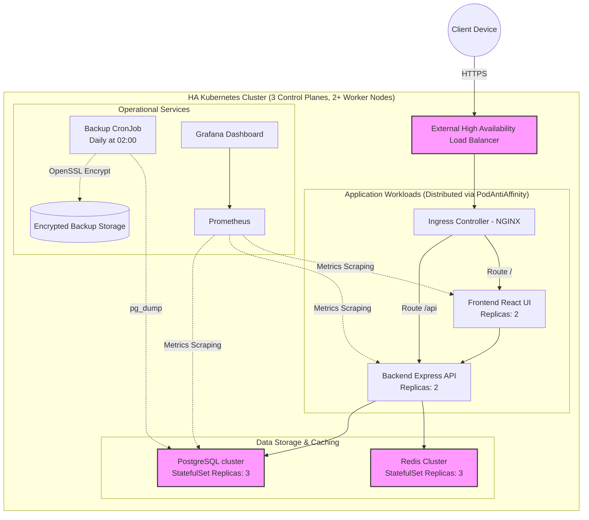

# Citizen Portal - Complete Project Documentation

This document serves as the comprehensive architectural reference, deployment manual, and operational playbook for the Citizen Portal system. It outlines the highly available Kubernetes topology, deployment strategies, and security protocols designed for robust production environments.

---

## 1. Architecture Diagram

The system employs a Highly Available (HA) Kubernetes architecture. It eliminates single points of failure across control planes, worker nodes, and data tiers, scaling efficiently to handle production workloads.



### Infrastructure Components
*   **Control Plane Nodes (3):** Utilizing embedded etcd (Raft consensus) to ensure API management and cluster operations remain available even if a control plane node is lost.
*   **Worker Nodes (2+):** Host application workloads. PodAntiAffinity rules guarantee that redundant replicas (e.g., Frontend, Backend, Data pods) never share the same physical worker node.
*   **Embedded etcd:** Clustered across all 3 Control Plane nodes for resilient cluster state data.
*   **Load Balancer:** A highly available layer 4/7 balancer routes traffic to active Ingress controllers distributed across multiple worker nodes.

---

## 2. Folder Structure

```text
.
├── backend/                       # Express.js REST API
│   ├── controllers/               # Route logic and business rules
│   └── middleware/                # Auth, logging, and error handling
├── frontend/                      # React.js SPA (Vite + Tailwind CSS)
│   ├── src/pages/                 # UI Views (Login, AdminLogin, etc.)
│   └── src/components/            # Shared UI components
├── helm/                          # Helm chart for package-based deployment
│   ├── templates/                 # Reusable Helm templates
│   └── values.yaml                # Environment-specific configuration values
├── k8s/                           # Raw Kubernetes Manifests
│   ├── monitoring/                # Prometheus & Grafana definitions
│   ├── backup-*.yaml              # Automated PostgreSQL backup configurations
│   ├── frontend-deployment.yaml   # Frontend deployments
│   ├── backend-deployment.yaml    # Backend API deployments
│   ├── database.yaml              # PostgreSQL HA StatefulSet configuration
│   └── redis.yaml                 # Redis HA StatefulSet configuration
├── .github/workflows/             # CI/CD pipeline definitions
│   └── ci-cd.yml                  # Main GitHub Actions pipeline
├── docker-compose.yml             # Local Dockerized development environment
└── .env.example                   # Environment variable templates
```

---

## 3. Deployment Guide

### Option A: Local Development (Docker Compose)
Ideal for local testing and debugging.
1. Populate `.env` from `.env.example`.
2. Start the services:
   ```bash
   docker-compose up --build -d
   ```

### Option B: Kubernetes via Helm (Recommended for Production)
Helm provides centralized configuration management for HA environments.
1. Initialize appropriate secrets or modify `helm/values.yaml`.
2. Install the Helm chart:
   ```bash
   helm install citizen-portal ./helm -n citizen-portal --create-namespace
   ```

### Option C: Raw Kubernetes Manifests
Apply declarative states directly to the HA cluster.
1. Apply ConfigMaps and Secrets:
   ```bash
   kubectl apply -f k8s/secret.yaml -f k8s/configmap.yaml
   ```
2. Apply StatefulSets (Data Layer):
   ```bash
   kubectl apply -f k8s/database.yaml -f k8s/redis.yaml
   ```
3. Apply Deployments and Disruptions Budgets (PDBs):
   ```bash
   kubectl apply -f k8s/pdb.yaml -f k8s/backend-deployment.yaml -f k8s/frontend-deployment.yaml
   ```

---

## 4. CI/CD Guide

The Continuous Integration & Deployment pipeline is managed via **GitHub Actions** (`.github/workflows/ci-cd.yml`). It enforces zero-trust security and automated testing.

**Pipeline Stages:**
1.  **Security Scan:** 
    * Runs Trivy File System (FS) and Configuration scanner.
    * Fails pipeline upon detecting **CRITICAL** vulnerabilities, exposed secrets, or severe configuration risks.
2.  **Build & Test:**
    * Compiles React Application and Express APIs.
    * Generates Build Artifacts.
3.  **Container Build & Image Scan:**
    * Builds Docker images.
    * Runs Trivy Container Scanning on local images. Pipeline is halted if **CRITICAL** CVEs are flagged.
4.  **Continuous Deployment (CD):**
    * Automatically pushes secure images to the registry.
    * Updates Kubernetes Deployments via seamless rolling updates.

---

## 5. Monitoring Guide

Real-time telemetry, logs, and trace metrics are captured through the Prometheus & Grafana stack.

*   **Prometheus:** Scrapes operational metrics (CPU, Memory, Pod restarts) and application-level metrics across nodes. Manifests are located in `k8s/monitoring/prometheus.yaml`.
*   **Grafana:** Visualizes metrics via interactive dashboards allowing point-in-time investigations.
*   **Health Probes:** Kubernetes utilizes extensive Liveness and Readiness probes (e.g., `pg_isready -U db_user -d citizen_portal`) to restart deadlocked pods and route traffic only to fully operational containers.

---

## 6. Backup Guide

Data is protected by an automated, encrypted Backup sequence native to Kubernetes via the `pg-backup` CronJob.

*   **Schedule:** Runs daily at 2:00 AM (`0 2 * * *`).
*   **Process:** 
    1. Executes `pg_dump`.
    2. Encrypts the raw SQL asynchronously via **OpenSSL AES-256-CBC** utilizing the `BACKUP_ENCRYPTION_PASSWORD`.
    3. Triggers immediate verification (dry-run decryption & mock restore validation).
*   **Storage:** Safely preserved on an independent Persistent Volume (`pg-backup-pvc`).
*   **Retention:** Automatic pruning purges encrypted archives older than 7 days.

---

## 7. Recovery Guide

Restoring the database from an encrypted backup is automated by triggering the `pg-restore` Kubernetes Job.

1.  Identify the target backup file name on the PVC (e.g., `db_backup_2026-06-21_02-00-00.sql.enc`).
2.  Edit `k8s/restore-job.yaml` and update the argument placeholder with the file name:
    ```yaml
    command: ["/bin/bash", "/scripts/restore.sh", "db_backup_2026-06-21_02-00-00.sql.enc"]
    ```
3.  Deploy the restore job:
    ```bash
    kubectl apply -f k8s/restore-job.yaml
    ```
4.  Track progress and verify successful completion:
    ```bash
    kubectl logs -l job-name=pg-restore -n citizen-portal
    ```

---

## 8. Scaling Guide

Scaling is fully supported across all system layers:

*   **Manual Horizontal Scaling:** Can be updated dynamically via Helm or kubectl.
    ```bash
    kubectl scale deployment frontend --replicas=5 -n citizen-portal
    ```
*   **Pod Anti-Affinity:** Workloads explicitly restrict Kubernetes from grouping matching replicas onto the same Worker node, inherently ensuring tolerance against partial physical infrastructure loss.
*   **Pod Disruption Budgets (PDB):** Defined in `k8s/pdb.yaml`. Guarantees a minimum required set of pods remain active during voluntary node disruption (e.g., upgrade or patching events), achieving zero-downtime upgrades.

---

## 9. Security Guide

A defense-in-depth approach defines the architectural security:

*   **Automated Pipeline Gates:** Trivy enforces strict prevention of CRITICAL CVEs OS-level, Library-level, or Secret-level. 
*   **Encrypted Data-At-Rest:** Database backups leverage zero-knowledge architecture requiring AES-256 decryption.
*   **Secret Management:** Kubernetes Secrets are rigidly isolated using `secretRef` mapping avoiding environment-variable leakage via code repositories. 
*   **API Security:** All authenticated routes evaluate secure JWT definitions signed by heavily rotated `JWT_SECRET` keys. Admin interfaces restrict cross-tenant escalation.
*   **RBAC Integrations:** Dedicated minimal-permission ServiceAccounts (`frontend-sa`, `backend-sa`) are assigned to workflows instead of relying on default cluster roles.

---

## 10. Troubleshooting Guide

**Scenario: Application Unavailable / 502 Bad Gateway**
*   Check Ingress and LoadBalancer status: 
    ```bash
    kubectl get ingress -n citizen-portal
    ```
*   Verify Backend pods readiness:
    ```bash
    kubectl get pods -l app=backend -n citizen-portal
    ```
*   Analyze Application Logs:
    ```bash
    kubectl logs -l app=backend -n citizen-portal --tail=100
    ```

**Scenario: Database Connection Errors**
*   Confirm Postgres instances are running via StatefulSets:
    ```bash
    kubectl get statefulsets -n citizen-portal
    ```
*   Exec into a backend pod to test database DNS resolution directly:
    ```bash
    kubectl exec -it deployment/backend -n citizen-portal -- sh
    ping db.citizen-portal.svc.cluster.local
    ```

**Scenario: Backup Failing**
*   Interrogate CronJob history and logs:
    ```bash
    kubectl get cronjobs -n citizen-portal
    kubectl logs -l job-name=pg-backup-[latest_id] -n citizen-portal
    ```
